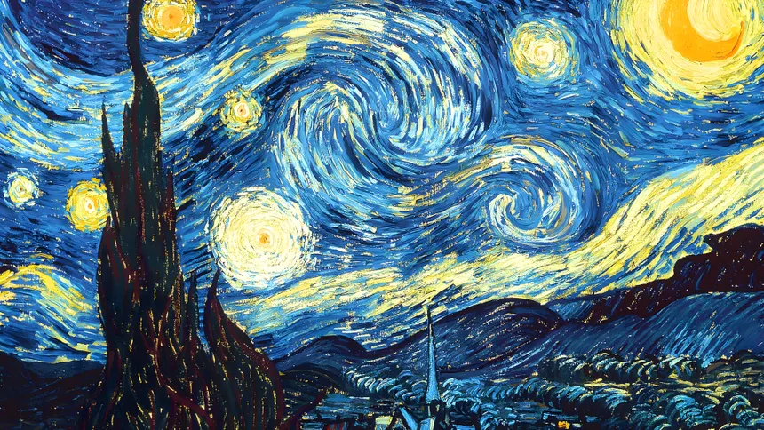

<div align="center">



# Olá, eu sou o João Vitor Maia 🎨

<p align="center">
  
</p>

`Resolverdo de Poblema` &nbsp; `CLAREZA` &nbsp; `EVOLUÇÃO`

<p align="center">
<a href="www.linkedin.com/in/joão-vitor-da-silva-maia-32169a386">
  
</a>
<a href="joao221033@gmail.com">
  
</a>

</p>

</div>

---

## 🖌️ Sobre mim

Gosto de transformar ideias em projetos bem construídos, funcionais e com atenção aos detalhes. Não me contento com "funciona" — quero que funcione *bem* e que pareça certo. Estou sempre aprendendo, criando e buscando novos desafios.

- 🎨 Acredito que boa engenharia e bom design não são coisas separadas.
- 🔍 Obcecado por clareza — no código, na interface e na comunicação.
- 🌱 Cada projeto é uma pincelada a mais na mesma tela em construção.

## 🧭 Foco atual

```text
→ Construir projetos consistentes
→ Evoluir como desenvolvedor
→ Criar soluções que façam diferença
```

## 🧰 Tech stack

<p>
  
</p>


---

## 💬 Vamos construir algo?

Se tiver uma ideia, oportunidade ou projeto interessante, fique à vontade para entrar em contato.

<div align="center">

✦ &nbsp; Obrigado pela visita &nbsp; ✦

</div>
